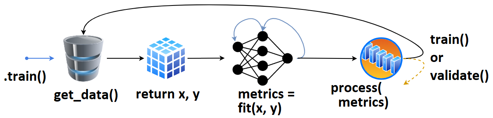
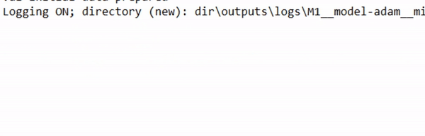
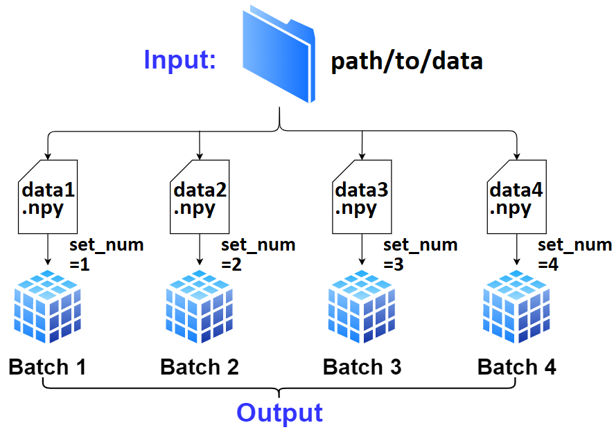
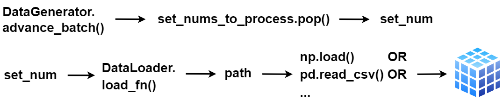

.. |br| raw:: html

  

How does ... work?
******************

TrainGenerator
==============

|br|

|br|

    1. User defines `tg = TrainGenerator(**configs)`,
    2. calls `tg.train()`.
    3. `get_data()` is called, returning data & labels,
    4. fed to `model.fit()`, returning `metrics`,
    5. which are then printed, recorded.
    6. The loop repeats, or `validate()` is called.

Once `validate()` finishes, training may checkpoint, and `train()` is called again. That's the (simlpified) high-level overview. 
Callbacks and other behavior can be configured for every stage of training.

DataGenerator
=============

|br|

    1. User defines `dg = DataGenerator(**configs)`.
    2. If not specified, `dg` infers the number of batches, file extension, data loader,
       and other necessary info solely from `data_path` / `labels_path`; this is "**AutoData**".
        
        - Only required is proper file naming; there's to be a "common" off of which `dg` can
          enlist `set_nums`, which is how it tracks all data internally.
        - Exception to above is if the path is to a single file containing all data; see
          :class:`DataGenerator`.
        
    3. Data (`x`) and labels (`y`) can be fetched with :meth:`DataGenerator.get`; by default
       it'll validate the batch and reset necessary attributes in case data "runs out" - to 
       prevent this, pass `skip_validation=True`.
    4. To move on to next batch (which `.get()` won't do automatically), call
       :meth:`DataGenerator.advance_batch`.
    5. The getting, advancing, and resetting is handled automatically within 
       :meth:`TrainGenerator.train` and :meth:`TrainGenerator.validate` at various stages.
	
	
DataLoader
==========

|br|

    - :class:`DataGenerator` is a "middle-man" between :class:`TrainGenerator` and the data, orchestrating *which* data is fetched at a point in training. 
    - The actual loading is handled by :class:`DataLoader`, with the customizable :meth:`~DataLoader.load_fn`.
